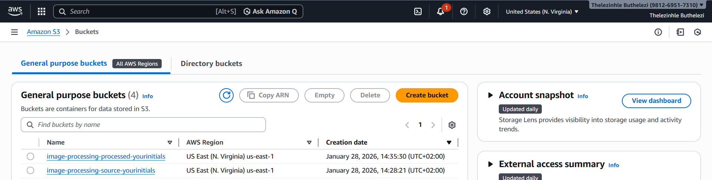
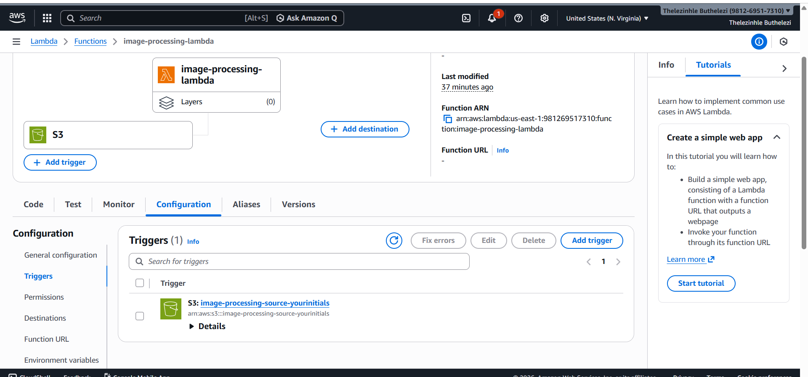
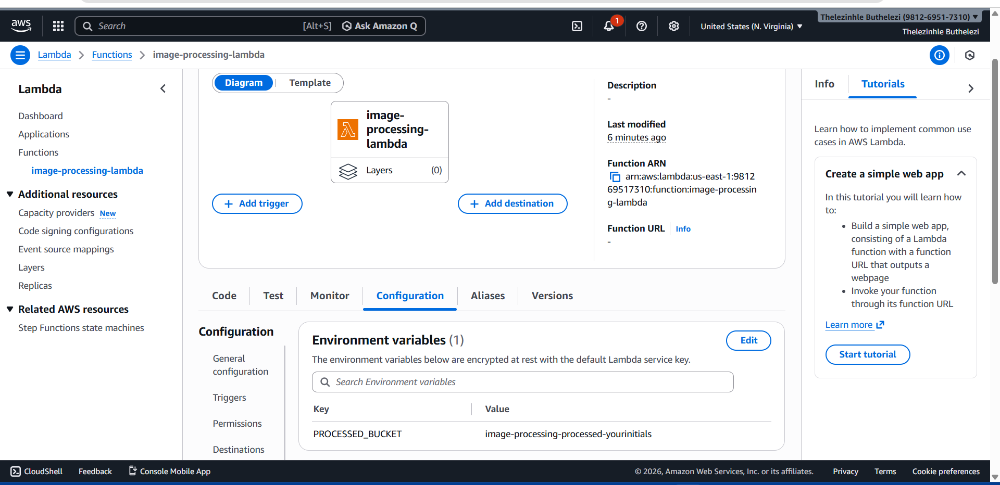
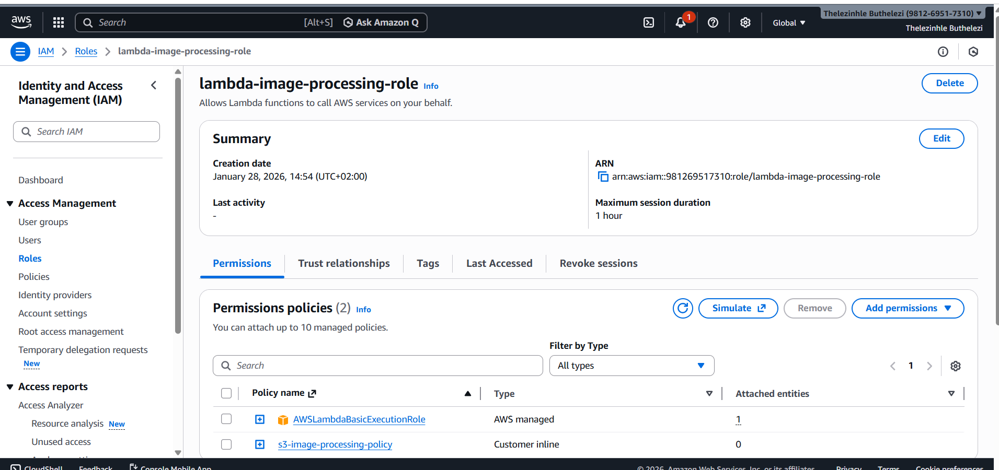
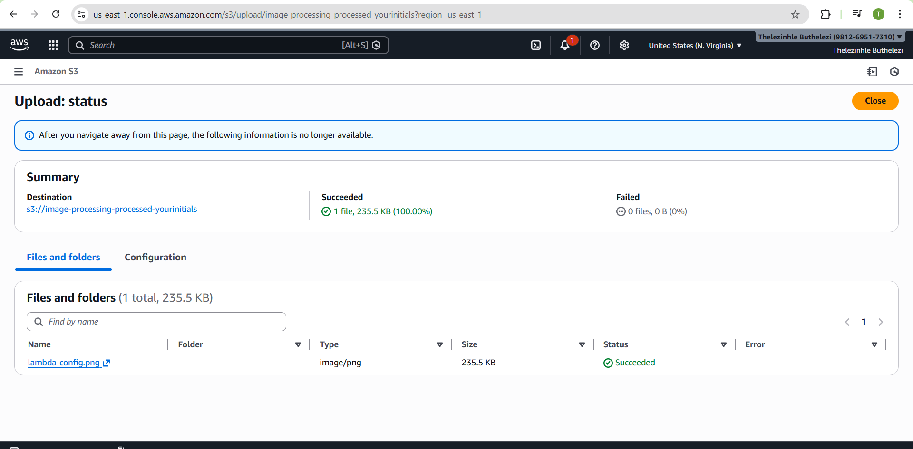

Automated Serverless Image Processing Pipeline

Overview

A serverless AWS pipeline that automatically generates 200x200 thumbnails when images are uploaded to an S3 bucket. This project shows event-driven architecture, serverless computing, and cloud automation in action.

How it works

1. User uploads image to the source S3 bucket
2. S3 event triggers the AWS Lambda function
3. Lambda downloads the image and resizes it to 200x200 using Pillow
4. The thumbnail gets saved to the processed S3 bucket

Architecture

The system uses S3 for storage, Lambda for processing, and IAM for security permissions. When an image is uploaded to the source bucket, an event notification automatically triggers the Lambda function. The function downloads the image, processes it with Pillow, and uploads the thumbnail to the processed bucket.

AWS Setup

S3 Storage
- Source bucket for receiving uploaded images
- Processed bucket for storing generated thumbnails

AWS Lambda Function
- Runtime: Python 3.14
- Handler: lambda_function.lambda_handler
- Uses Pillow library for image processing

Event Trigger
- Listens for S3 ObjectCreated events
- Automatically runs Lambda when images are uploaded to source bucket

Environment Configuration
- Sets the processed bucket name as an environment variable

IAM Security
- Custom role with least privilege permissions
- Allows Lambda to read from source bucket and write to processed bucket

Lambda Function Details

The lambda_function.py:
- Downloads images from the source S3 bucket
- Resizes images to 200x200 using Pillow
- Saves thumbnails to the processed S3 bucket
- Includes error handling and logging for debugging

Deployment

1. Create two S3 buckets (source and processed)
2. Set up an IAM role with S3 permissions
3. Create a Lambda function with Python runtime
4. Upload the Lambda code with Pillow dependency
5. Set the processed bucket name as an environment variable
6. Add the S3 trigger from the source bucket
7. Test by uploading an image to the source bucket

Functional Test

 architecture-diagram.png
 

Project Structure

image-processing-pipeline/
├── lambda_function.py
├── requirements.txt
├── README.md
├── architecture-diagram.png
└── screenshots/
    ├── s3-buckets.png
    ├── lambda-trigger.png
    ├── lambda-config.png
    ├── iam-policyg.png
    └── functional-test.png

What's Included

✅ Automatic thumbnail generation on image upload
✅ Secure IAM permissions with least privilege access
✅ Clean, efficient Lambda function with error handling
✅ Professional resource naming and configuration

License

MIT License - Feel free to use this project for learning and development
